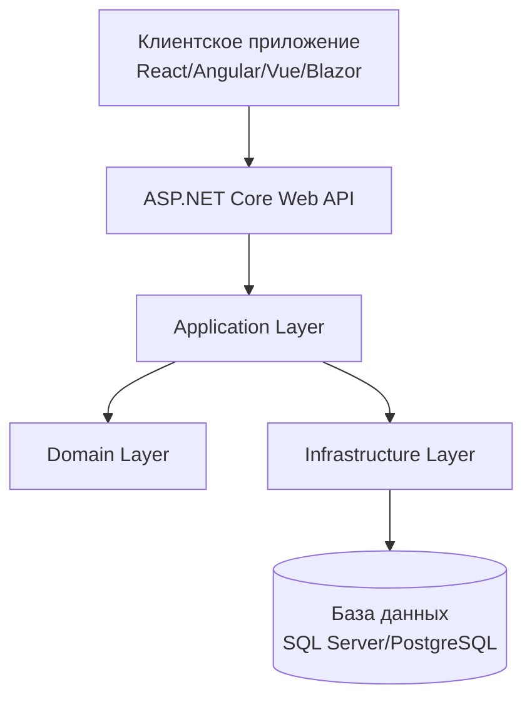
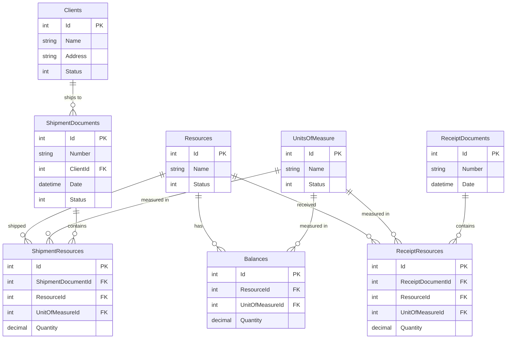

# Проект системы управления складом

## Обзор

Система управления складом представляет собой веб-приложение, построенное по принципам Clean Architecture с разделением на серверную часть (ASP.NET Core Web API) и клиентскую часть (SPA или MVC). Система обеспечивает управление складскими операциями с гарантией целостности данных и актуальности балансов.

## Архитектура

### Общая архитектура системы



### Слоистая архитектура (Clean Architecture)

1. **Presentation Layer (API Controllers)**
   - RESTful API контроллеры
   - Валидация входных данных
   - Маппинг DTO

2. **Application Layer**
   - Use Cases (команды и запросы)
   - Application Services
   - DTO и маппинг
   - Валидация бизнес-правил

3. **Domain Layer**
   - Доменные сущности
   - Доменные сервисы
   - Бизнес-правила
   - Domain Events

4. **Infrastructure Layer**
   - Репозитории
   - ORM конфигурация
   - Внешние сервисы

## Компоненты и интерфейсы

### Доменные сущности

```csharp
// Базовая сущность
public abstract class BaseEntity
{
    public int Id { get; set; }
    public EntityStatus Status { get; set; }
}

// Основные сущности
public class Resource : BaseEntity
{
    public string Name { get; set; }
}

public class UnitOfMeasure : BaseEntity  
{
    public string Name { get; set; }
}

public class Client : BaseEntity
{
    public string Name { get; set; }
    public string Address { get; set; }
}

public class Balance : BaseEntity
{
    public int ResourceId { get; set; }
    public int UnitOfMeasureId { get; set; }
    public decimal Quantity { get; set; }
}

public class ReceiptDocument : BaseEntity
{
    public string Number { get; set; }
    public DateTime Date { get; set; }
    public List<ReceiptResource> Resources { get; set; }
}

public class ShipmentDocument : BaseEntity
{
    public string Number { get; set; }
    public int ClientId { get; set; }
    public DateTime Date { get; set; }
    public DocumentStatus Status { get; set; }
    public List<ShipmentResource> Resources { get; set; }
}
```

### Ключевые интерфейсы

```csharp
// Репозитории
public interface IResourceRepository : IRepository<Resource>
{
    Task<bool> ExistsByNameAsync(string name, int? excludeId = null);
    Task<IEnumerable<Resource>> GetActiveAsync();
}

public interface IBalanceRepository : IRepository<Balance>
{
    Task<Balance> GetByResourceAndUnitAsync(int resourceId, int unitId);
    Task<IEnumerable<Balance>> GetFilteredAsync(BalanceFilter filter);
}

public interface IDocumentRepository<T> : IRepository<T> where T : class
{
    Task<bool> ExistsByNumberAsync(string number, int? excludeId = null);
}

// Доменные сервисы
public interface IBalanceService
{
    Task UpdateBalanceAsync(int resourceId, int unitId, decimal quantity);
    Task ValidateBalanceAvailabilityAsync(int resourceId, int unitId, decimal requiredQuantity);
}

public interface IDocumentService
{
    Task ProcessReceiptDocumentAsync(ReceiptDocument document);
    Task ProcessShipmentDocumentAsync(ShipmentDocument document, bool isApproval);
}
```

### API Endpoints

```
# Справочники
GET    /api/resources
POST   /api/resources
PUT    /api/resources/{id}
DELETE /api/resources/{id}
PUT    /api/resources/{id}/archive

GET    /api/units
POST   /api/units
PUT    /api/units/{id}
DELETE /api/units/{id}
PUT    /api/units/{id}/archive

GET    /api/clients
POST   /api/clients
PUT    /api/clients/{id}
DELETE /api/clients/{id}
PUT    /api/clients/{id}/archive

# Баланс склада
GET    /api/balance?resourceIds=1,2&unitIds=1,2

# Документы поступления
GET    /api/receipts?dateFrom=2024-01-01&dateTo=2024-12-31&numbers=DOC001,DOC002&resourceIds=1,2&unitIds=1,2
POST   /api/receipts
PUT    /api/receipts/{id}
DELETE /api/receipts/{id}

# Документы отгрузки
GET    /api/shipments?dateFrom=2024-01-01&dateTo=2024-12-31&numbers=SHIP001,SHIP002&resourceIds=1,2&unitIds=1,2
POST   /api/shipments
PUT    /api/shipments/{id}
DELETE /api/shipments/{id}
PUT    /api/shipments/{id}/approve
PUT    /api/shipments/{id}/revoke
```

## Модели данных

### Схема базы данных



### Перечисления

```csharp
public enum EntityStatus
{
    Active = 1,
    Archived = 2
}

public enum DocumentStatus
{
    Draft = 1,
    Approved = 2
}
```

## Обработка ошибок

### Типы ошибок

1. **Валидационные ошибки** (400 Bad Request)
   - Дублирование наименований/номеров
   - Пустые обязательные поля
   - Некорректные форматы данных

2. **Бизнес-ошибки** (422 Unprocessable Entity)
   - Недостаточный баланс для операции
   - Попытка удаления используемой сущности
   - Попытка создания пустого документа отгрузки

3. **Ошибки доступа** (404 Not Found)
   - Сущность не найдена
   - Архивная сущность недоступна для операций

### Структура ответа об ошибке

```json
{
  "error": {
    "code": "INSUFFICIENT_BALANCE",
    "message": "Недостаточно ресурсов на складе",
    "details": {
      "resourceId": 1,
      "required": 100,
      "available": 50
    }
  }
}
```

## Стратегия тестирования

### Уровни тестирования

1. **Unit Tests**
   - Доменные сущности и их методы
   - Доменные сервисы
   - Application Services
   - Валидаторы

2. **Integration Tests**
   - Репозитории с реальной БД
   - API контроллеры
   - Сценарии работы с балансом

3. **End-to-End Tests**
   - Полные пользовательские сценарии
   - Тестирование через UI

### Критические сценарии для тестирования

1. **Целостность баланса**
   - Одновременные операции с одним ресурсом
   - Откат транзакций при ошибках
   - Корректность пересчета при редактировании документов

2. **Бизнес-правила**
   - Проверка уникальности наименований
   - Валидация архивных сущностей
   - Проверка достаточности ресурсов

3. **Производительность**
   - Фильтрация больших объемов данных
   - Пагинация результатов
   - Оптимизация запросов к БД

### Инструменты тестирования

- **xUnit** - основной фреймворк для тестирования
- **FluentAssertions** - для читаемых утверждений
- **Moq** - для создания mock-объектов
- **TestContainers** - для интеграционных тестов с БД
- **WebApplicationFactory** - для тестирования API

## Технические детали реализации

### ORM и работа с данными

- **Entity Framework Core** как основная ORM
- **Fluent API** для конфигурации сущностей
- **Migrations** для управления схемой БД
- **Connection Pooling** для оптимизации подключений

### Обеспечение целостности данных

- **Транзакции** для атомарности операций с балансом
- **Optimistic Concurrency** для предотвращения конфликтов
- **Database Constraints** для обеспечения целостности на уровне БД
- **Domain Events** для согласованности изменений

### Производительность

- **Lazy Loading** отключен, используется явная загрузка связанных данных
- **Projection** для оптимизации запросов на чтение
- **Caching** для справочных данных
- **Pagination** для больших наборов данных

### Безопасность

- **Input Validation** на всех уровнях
- **SQL Injection Protection** через параметризованные запросы
- **CORS Configuration** для клиентского приложения
- **Error Handling** без раскрытия внутренней информации